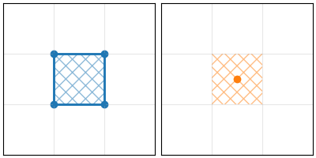
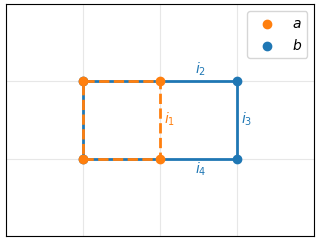
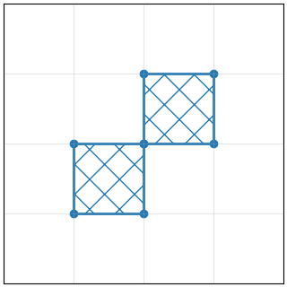
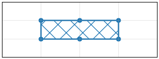

## Choice of pixel representation

In DisTorch, we chose to represent each pixel by its contour.
In other words, the whole pixel belongs to the segmentation.
This differs from several libraries, where each pixel is represented by its center point.
We argue this poses many problems.
In particular, this does not conserve area, especially for single pixels as shown below, where the area becomes 0, and it does not conserve perimeter.

<p align="center">
  
</p>

## Average Surface Distance

One of the metrics used to compare two segmentations is the Average Surface Distance (ASD), which is directed, or its symmetric variant: ASSD.
Computing the ASD from a segmentation $\Omega_a$ to a segmentation $\Omega_b$, noted $\mathrm{ASD}_{a\rightarrow b}$, requires computing the following integral:
```math
\mathrm{ASD}_{a\rightarrow b} = \frac{1}{|\partial \Omega_a|}\int_{x\in\partial \Omega_a}\|x-\mathcal{P}_{\partial\Omega_b}(x)\|_2 dx
```
where $\partial \Omega_a$ is the boundary of $\Omega_a$, $|\partial \Omega_a|$ is its length and $\mathcal{P}_{\partial\Omega_b}$ is the projection operator onto the boundary $\partial\Omega_b$.

The ASSD is usually defined as:
```math
\mathrm{ASSD}(a, b) = \frac{|\partial \Omega_a| \mathrm{ASD}_{a\rightarrow b} + |\partial \Omega_b| \mathrm{ASD}_{b\rightarrow a}}{|\partial \Omega_a| + |\partial \Omega_b|}
```

### Approximation

To the best of our knowledge, there is no clear way to do this efficiently.
Generally, computing this integral is very costly. One way is to approximate the integral by a quadrature, or in other words, to sample linearly spaced points over the boundary.

### Pixel vertices as an approximation

In DisTorch, we make the choice of approximating this integral by using the vertices of the pixels as the linearly spaced points on the boundary. This has the advantages of being reasonably fast and providing a good approximation of the integral.

However, there are some limits to this approximation. We can build edge cases where this provides a wrong result. For instance, consider the following segmentations:
<p align="center">
  
</p>

Here we can compute the values of $`\mathrm{ASD}_{a\rightarrow b}`$ and $`\mathrm{ASD}_{a\rightarrow b}`$ manually:
- $`\mathrm{ASD}_{a\rightarrow b} = \frac14(3\times 0 + i_1) = \frac14\times 2\int_{t=0}^{0.5}t dt = \frac{1}{16}`$
- $`\mathrm{ASD}_{b\rightarrow a} = \frac16(3\times 0 + i_2 + i_4 + i_3) = \frac16 (2\int_{t=0}^{1}t dt + \int_{t=0}^1 1 dt)= \frac16(2\times \frac12+1)=\frac13`$
- $`\mathrm{ASSD}(a,b) = \frac{4\times\frac1{16} + 6\times\frac13}{4 + 6} = \frac{9}{40}=0.225`$

In comparison, using pixel vertices to approximate the boundary, we get $`\mathrm{ASD}_{a\rightarrow b}=0`$, $`\mathrm{ASD}_{b\rightarrow a}=\frac13`$ and $`\mathrm{ASSD}(a,b)=0.2`$.

### Vertices effective size

In the previous examples, the boundaries are simple, and have the same length as the number of vertices.
However, this is not always the case. Consider the following example:
<p align="center">
  
</p>
The boundary has a length of 8, but there are only 7 vertices. Therefore, The integral approximation deviates even more.
We could duplicate the vertex in the middle to account for that, but it would incur some additional computational cost.
Additionally, this does not generalize to anisotropic cases, such as the following example:
<p align="center">
  
</p>

A better approach is to compute an _effective_ size for each vertex.
In 2d, this corresponds to the length of the section of the boundary that is associated with a vertex.
In the previous example, the effective size of the middle vertices is larger than the effective size of the corner vertices.
In loser terms, these vertices have "more boundary", and therefore have a larger size. 
Taking this into account in the approximations of the integrals amounts to performing a weighted average of the vertices distances.
Going back to the diagonal example, we give a weight of 2 to the center vertex, while the others have a weight of 1.

In DisTorch, this is the default behavior, and it can be controlled with `weight_by_size` argument in `distorch.boundary_metrics`. 

## Anisotropy

In medical imaging, it is often the case that voxels are not cubes, but rather rectangular parallelepiped.
This is due to the acquisition process in MRI or CT machines, which rotate around the patient and advance linearly along the rotation axis.
This produces slices with a thickness that differs from the planar resolution.

This needs to be taken into account in the calculations to get meaningful distances.
This can be achieved by passing the size of a unit element (_i.e._ resolution), often obtained from `.nii` file:
```python
import nibabel
nii_file = nibabel.load(...)
element_size = tuple(map(float, nii_file.header.get_zooms()))
```
and passing it: `distorch.boundary_metrics(..., element_size=element_size)`.

Additional care is taken to ensure that anisotropy and vertices size correctly interact together.